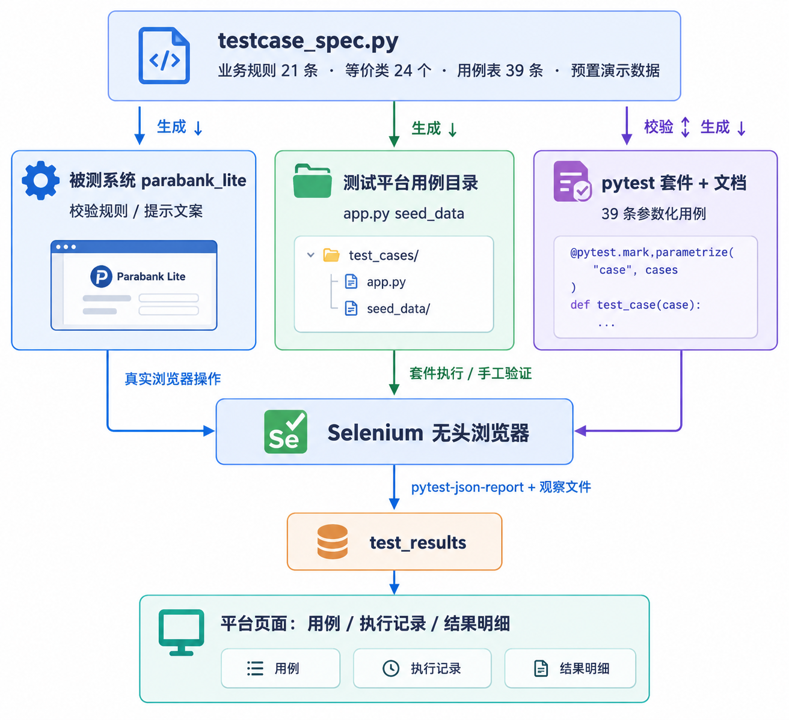
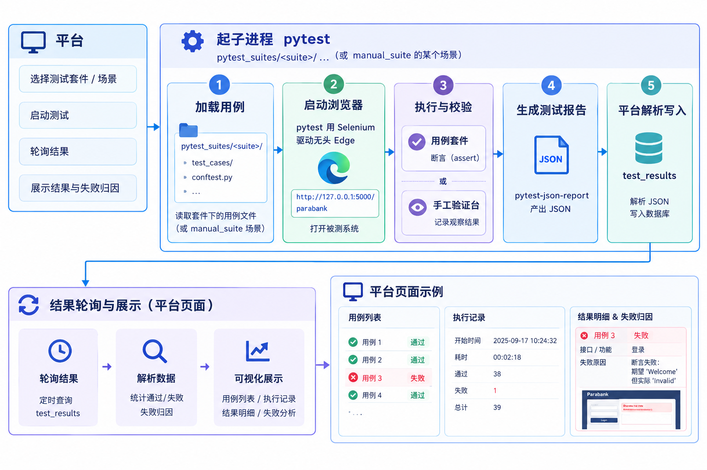
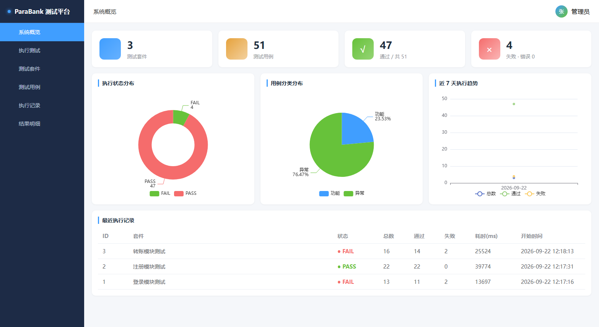
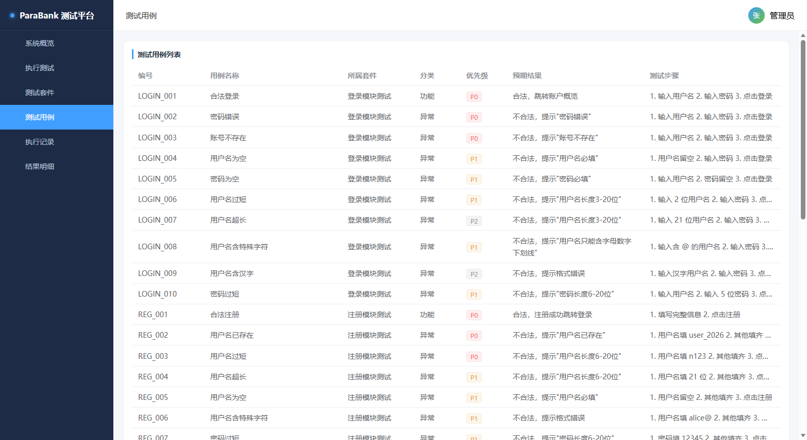
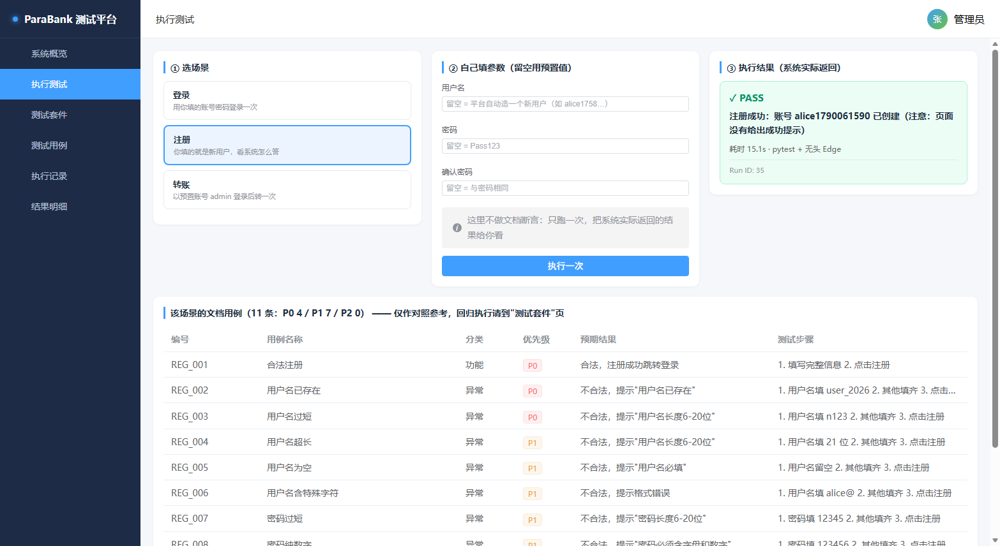
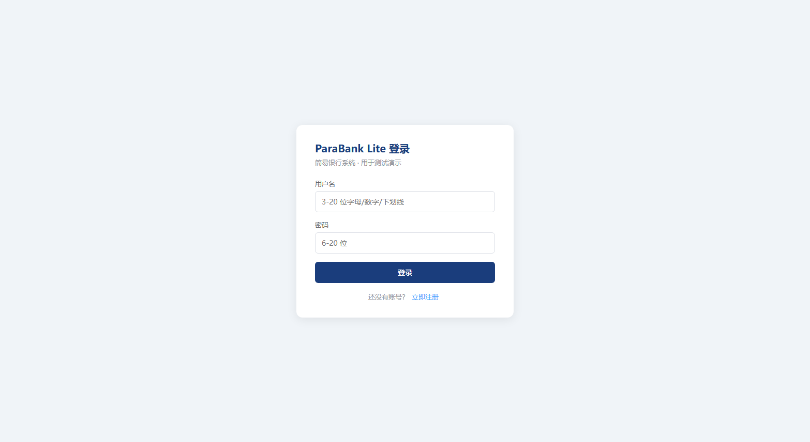

# ParaBank Lite 自动化测试平台

### 自建被测系统 + pytest/Selenium 用例套件 + Flask 测试平台的一体化实践


一个**开箱可跑**的测试实践项目：自己造一套简易银行系统（被测系统），用 pytest + Selenium
写 39 条用例，再配一个能看到套件、用例、执行记录、失败归因和手工验证台的测试平台。
三部分共用同一份用例表，改一处即可全局同步，另有校验脚本兜底。

`业务规则与用例设计` · `快速开始` · `手工验证台` · `缺陷演示` · `文档`

---

## 项目简介

一个完整的测试工程通常有三块拼图，这个项目把它们放进同一个仓库，并且让它们**强一致**：

| 角色 | 是什么 | 在哪 |
|------|--------|------|
| 被测系统 | ParaBank Lite —— 登录 / 注册 / 转账的简易银行系统（Flask + SQLite） | `parabank_lite.py`、`templates/parabank/` |
| 自动化用例 | 39 条 pytest + Selenium 用例，按登录 10 / 注册 11 / 转账 18 分三个套件 | `pytest_suites/` |
| 测试平台 | 展示套件与用例、触发执行、看执行记录、失败归因、手工验证台 | `app.py`、`static/` |
| 单一事实来源 | 业务规则、等价类划分、用例表、预置数据 | `testcase_spec.py` |

核心设计是**单一事实来源**：`testcase_spec.py` 里写着 39 条用例的数据与预期结果，
被测系统的校验逻辑、平台库里的用例目录、pytest 套件、以及 `docs/` 下的用例文档
全部由它派生。用例表一变，`check_consistency.py` 会把不一致的地方全部指出来。

## 架构

**① 单一事实来源与三层结构**：`testcase_spec.py` 是唯一来源（业务规则 21 条 · 等价类 24 个 ·
用例表 39 条 · 预置演示数据），被测系统的校验逻辑、平台的用例目录、pytest 套件与文档全部由它
派生，`check_consistency.py` 负责把不一致的地方兜住。



**② 一次"执行"的完整链路**：平台起 pytest 子进程 → pytest 用 Selenium 驱动无头 Edge 打开被测
系统（用例套件做断言，手工验证台只记录系统实际返回）→ pytest-json-report 产出 JSON → 平台解析
写入 `test_results` → 页面轮询展示结果、失败归因与统计。



## 目录结构

```
parabank_project/
├── app.py                      测试平台（Flask API + 触发 pytest + 结果解析）
├── parabank_lite.py            被测系统 ParaBank Lite（Flask Blueprint + SQLite）
├── testcase_spec.py            业务规则 / 等价类 / 39 条用例 / 预置数据 —— 单一事实来源
├── browser_setup.py            跨平台浏览器与路径配置、参数覆盖
├── check_consistency.py        前后一致性校验器（22 项）
├── gen_case_doc.py             由用例表生成 docs/测试用例设计.md
├── requirements.txt            依赖清单
├── run_windows.bat             Windows 一键启动（自动建 venv 装依赖）
├── templates/parabank/         被测系统页面（登录 / 注册 / 账户 / 转账 / 流水）
├── static/                     平台前端（index.html + Vue + Element Plus + ECharts）
├── pytest_suites/
│   ├── login_suite/            登录 10 条
│   ├── register_suite/         注册 11 条
│   ├── transfer_suite/         转账 18 条
│   └── manual_suite/           手工验证台：跑一次真实操作，只记录系统实际返回
├── docs/
│   ├── 测试用例设计.md          业务规则 + 等价类 + 用例表（39 条）+ 文案对照 + 缺陷清单
│   ├── 测试规则文档.md          用例编号 / 优先级 / 判定与归因 / 套件规范 / 触发规则
│   └── 数据库设计文档.md        平台库表结构与数据来源
└── figs/                       README 截图
```

## 快速开始

环境要求：**Windows**（也兼容 Linux/macOS）、**Python 3.11+**、本机装有 **Chrome 或 Edge**。
驱动不用自己装，Selenium Manager 会自动匹配（内网环境可设 `PB_DRIVER_PATH` 指定）。

### 方式 A —— 一键启动（Windows）

```bat
run_windows.bat
```

首次运行会自动创建 `.venv` 并安装 `requirements.txt`，然后启动平台。

### 方式 B —— 手动

```bash
python -m venv .venv
.venv\Scripts\python.exe -m pip install -r requirements.txt   # Windows
# source .venv/bin/activate && pip install -r requirements.txt  # Linux/macOS
.venv\Scripts\python.exe app.py
```

启动后：

| 入口 | 地址 |
|------|------|
| 测试平台 | http://127.0.0.1:5000/ |
| 被测系统 | http://127.0.0.1:5000/parabank/login |

预置账号（启动时自动重建，套件执行前自动复位）：

| 账号 | 密码 | 账户 | 余额 |
|------|------|------|------|
| admin | admin123 | 10001 / 10002 / 10003 | 100000.00 / 0.00 / 100.00 |
| user_2026 | Pass123 | 20002 | 0.00 |

## 使用说明

### 手工验证台（"执行测试"页）

自己填参数 → 点"执行一次"，用真实浏览器跑**一次**操作，看系统怎么答。不做文档断言。

- 三个场景：登录 / 注册 / 转账；留空的字段用预置值
- **注册场景用户名留空**＝平台自动造一个新用户（"假装新用户"，如 `alice1758…`）
- 判定口径看"这次操作实际成没成"：注册看账号是否真的建进库，转账看余额是否变化，
  登录看是否进入账户概览；页面的错误提示会作为失败原因原样带出
- 系统提示原文写入"结果明细"的**实际提示**列；若操作生效但页面没给反馈，会注明
  "页面没有给出成功提示"

### 套件回归（"测试套件"页）

点"执行整套件"跑该套件全部用例（带文档断言）。结果实时回填：
执行记录页看汇总，结果明细页看每条用例的状态、失败原因（`ASSERT_` / `TIMEOUT_` /
`NOELEMENT_` / `NETWORK_` / `DRIVER_`）、堆栈与耗时。

实测耗时（本机无头 Edge）：登录套件 14s、注册套件 24s、转账套件 66s，全套 39 条约 100 秒。

### 一致性校验

```bash
.venv\Scripts\python.exe check_consistency.py --online
```

22 项校验横跨五个层面：用例表自洽 → 被测系统校验层 → 平台库 → pytest 收集 → 文档同步，
外加"平台实际执行的失败集合 == 缺陷清单"。

## 用例设计

用例表严格按《ParaBank Lite 业务规则与测试用例设计》落地，共 **39 条**：

| 模块 | 规则数 | 等价类数 | 用例数 | P0 | P1 | P2 | 套件 |
|------|--------|----------|--------|----|----|----|------|
| 登录 | 7 | 7 | 10 | 3 | 5 | 2 | `login_suite` |
| 注册 | 7 | 8 | 11 | 4 | 7 | 0 | `register_suite` |
| 转账 | 7 | 9 | 18 | 6 | 9 | 3 | `transfer_suite` |
| **合计** | **21** | **24** | **39** | **13** | **21** | **5** | |

设计文档里同时记录了**文档自身的矛盾之处与落地口径**（例如登录用户名长度文档规则写
6~20、但用例表与预置账号 `admin`（5 位）都是 3~20，最终按 3~20 落地；注册的手机号与
邮箱功能本期不做，规则与用例一并移出范围）。

详见 [docs/测试用例设计.md](docs/测试用例设计.md)。

## 缺陷注入演示

为了让平台的失败归因、失败明细、状态分布这些能力有东西可看，被测系统里**刻意注入**了
5 处缺陷（每一处都注明违反了文档哪条规则、预期让哪几条用例失败）：

| 缺陷 | 违反的规则 | 预期失败用例 | 归因 |
|------|-----------|--------------|------|
| BUG-01 登录未区分"账号不存在"与"密码错误" | 2.1(5)(6) | LOGIN_002、LOGIN_003 | `ASSERT_` |
| BUG-02 金额上限边界写成"≥50000 即超限" | 2.3(2) | TRAN_005 | `ASSERT_` |
| BUG-04 注册成功后不显示成功提示 | REG_001 预期"注册成功" | REG_001 | `TIMEOUT_` |
| BUG-05 转账成功后不显示成功提示 | TRAN_001~004 预期"转账成功" | TRAN_001~004 | `TIMEOUT_` |
| BUG-06 漏做"小数点最多 1 个"校验 | 2.3(4) | TRAN_013 | `ASSERT_` |

预期结果：**39 条用例 30 通过 / 9 失败**，失败集合必须正好等于上表——
多红一条或少红一条，`check_consistency.py` 都会报错。

关掉注入缺陷（恢复"完全符合文档"的系统，39 条应当全绿）：把 `parabank_lite.py` 里的
`INJECT_DEFECTS` 改为 `False`，重启平台即可。

## 截图

平台概览（用例数、通过率、状态分布、近 7 天趋势）：



测试用例（39 条，编号即 pytest 参数化 ID）：



手工验证台（自己填参数跑一次，显示系统实际返回）：



被测系统：



## 文档索引

| 文档 | 内容 |
|------|------|
| [docs/测试用例设计.md](docs/测试用例设计.md) | 业务规则、等价类划分、39 条用例表、提示文案对照、缺陷清单（由 `gen_case_doc.py` 生成） |
| [docs/测试规则文档.md](docs/测试规则文档.md) | 用例编号、优先级、结果判定与失败归因、套件规范、触发规则、一致性维护流程 |
| [docs/数据库设计文档.md](docs/数据库设计文档.md) | 平台库六张表结构、索引、数据来源与预置数据 |

## 常见问题

**Q：注册明明成功了，为什么显示 FAIL？**
被测系统里注入了 BUG-04（注册成功后不显示成功提示）。手工验证台会补注"账号已创建"，
用例套件则按文档要求判 FAIL——这正是缺陷被抓住的地方。

**Q：`para_test.py` / `test_engine.py` 是什么？**
早期版本的脚本，选择器和写库字段都已经和现版本对不上，未纳入本仓库。

**Q：不想用 Edge / 想看得见浏览器 / 想调等待时间？**

```bat
set PB_BROWSER_BINARY=C:\Program Files\Google\Chrome\Application\chrome.exe
set PB_HEADLESS=0        &:: 显示浏览器窗口
set PB_WAIT=5            &:: 等待元素的秒数，默认 8
set PB_SECRET_KEY=xxx    &:: 平台会话密钥，默认用本地演示值
```

**Q：几个套件能同时跑吗？**
同一套件同时只能有一个执行（防重复点击）；不同套件可以，但会共用 SQLite，平台已把
锁等待调到 15 秒。稳妥起见建议串行。

**Q：换机器跑要做哪些事？**
只要有 Python 3.11+ 和 Chrome/Edge：`python -m venv .venv` → 装 `requirements.txt` →
`python app.py`。数据库、报告目录、预置演示数据都会自动创建。

## 贡献

欢迎提 Issue / PR。改动用例表请走这条链路，保证前后一致：

```bash
# 1) 改用例表（testcase_spec.py），必要时把 app.py 的 SEED_VERSION +1
# 2) 重新生成文档
.venv\Scripts\python.exe gen_case_doc.py
# 3) 校验五个层面是否同步
.venv\Scripts\python.exe check_consistency.py --online
# 4) 需要的话把用例表基线同步到 check_consistency.py 的 EXPECT_CASES / EXPECT_PRIORITY
```

## 许可

本项目采用 [MIT License](LICENSE)。

## 免责声明

被测系统 ParaBank Lite 是为教学与测试演练而**自建**的简易系统，非真实银行系统，
不涉及任何真实资金与个人数据；仓库中的账号、余额、交易流水全部为虚构的演示数据。

**安全说明**：本仓库不含任何 API Key、令牌、第三方服务凭据或真实用户信息。
平台的会话密钥从环境变量 `PB_SECRET_KEY` 读取，未设置时使用本地演示缺省值；
预置账号（`admin/admin123`、`user_2026/Pass123`）是自建演示系统的固定测试账号，
仅用于本机演示与自动化测试。请勿将本项目的 Flask 开发服务器与演示账号用于生产环境。
